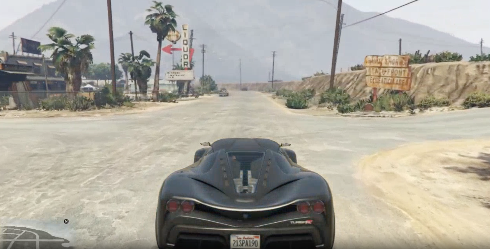
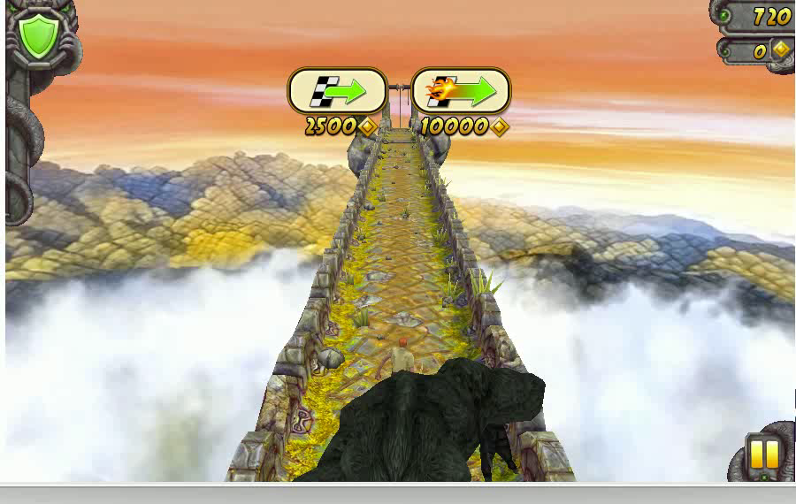
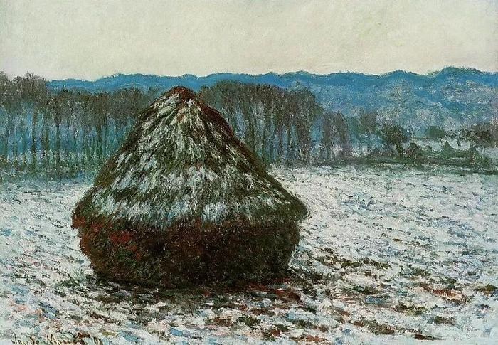

## {background-image="assets/matrix-game/mg2/cover.png" background-size="cover" background-position="center"}

::: {.title-overlay}

### Matrix-Game 2.0

**Real-Time Interactive Worlds**

:::

::: {.notes}
Welcome to Matrix-Game 2.0. Three months ago, we proved that AI could dream game worlds. Today, we make those dreams run in real time — 25 frames per second, streaming generation, and it works beyond Minecraft. Let's dive in.
:::

## Where We Left Off

:::: {.two-col}
::: {.column}
### Matrix-Game 1.0

- 17B parameter world model
- Minecraft-only, offline batch generation
- 96% human preference vs baselines

::: {.warningbox}
**Not real-time.** Frames generated in batches, not streams.
:::
:::

::: {.column}
### v2 Goals

::: {.fragment}
- [Real-time 25fps streaming]{.hi}
- Multi-game: GTA, TempleRun, Universal
:::
:::
::::

::: {.notes}
Matrix-Game 1.0 was our proof of concept — a 17-billion parameter model that generated interactive Minecraft worlds with 96% human preference over baselines. But it had a critical limitation: frames generated in batches, not streams. You couldn't play in real time. That's the gap we set out to close with v2.
:::

## 25 Frames Per Second

::: {.keybox}
**40ms per frame.** Every frame must be spatially coherent, temporally consistent, and responsive to player input.
:::

::: {.fragment}
::: {.methodbox}
**The challenge:** Real-time diffusion-based generation at interactive speed on a single GPU.
:::
:::

::: {.notes}
Here's the challenge distilled to one number: 25 frames per second. That means 40 milliseconds per frame. Each frame must maintain spatial coherence with the scene, temporal consistency with previous frames, and immediate responsiveness to keyboard and mouse input. This is orders of magnitude harder than batch generation.
:::

## Architecture {.section-header}

::: {.notes}
Let me walk you through how we achieve this. The core innovation is an auto-regressive diffusion framework designed for streaming.
:::

## AR-Diffusion Streaming Pipeline

```{mermaid}
%%| fig-width: 16
flowchart LR
    IN[Input Frame + Action] --> C1[Chunk 1 Denoise]
    C1 --> C2[Chunk 2 Denoise]
    C2 --> C3[Chunk 3 Denoise]
    C3 --> OUT[Streaming Output]

    KV[KV Cache Reuse] -.-> C1
    KV -.-> C2
    KV -.-> C3

    style IN fill:#3730a3,color:#fff
    style C1 fill:#1a8a8a,color:#fff
    style C2 fill:#1a8a8a,color:#fff
    style C3 fill:#1a8a8a,color:#fff
    style OUT fill:#2d9050,color:#fff
    style KV fill:#c69a2d,color:#fff
```

::: {.methodbox}
**Auto-Regressive Diffusion:** Each chunk conditions on the previous output. KV-cache reuse eliminates redundant computation.
:::

::: {.notes}
The pipeline works as a streaming auto-regressive diffusion model. We generate frame chunks sequentially — each conditioned on the previous one. The key engineering insight is KV-cache reuse, which avoids redundant computation across chunks. This is what makes 25fps possible on a single GPU.
:::

## Self-Forcing Training

:::: {.two-col}
::: {.column}
::: {.warningbox}
**Error Drift** — Naive AR accumulates artifacts. Small errors cascade into scene degradation over long sequences.
:::
:::

::: {.column}
::: {.tipbox}
**Self-Forcing** — Train on the model's own outputs, teaching it to self-correct from imperfect inputs.
:::
:::
::::

::: {.notes}
The biggest technical challenge with auto-regressive generation is error drift. In naive AR, small artifacts cascade forward and degrade the scene. Self-Forcing solves this elegantly: during training, we feed the model its own predictions rather than ground truth. This teaches the model to self-correct, maintaining quality across hundreds of frames.
:::

## Action Control

:::: {.two-col}
::: {.column}
{width="85%"}
:::

::: {.column}
- **Mouse position** mapped to camera direction
- **Keyboard state** encoded as action vectors
- **Injected per denoising step**

::: {.keybox}
Actions modulate generation at the denoising level, not just per frame.
:::
:::
::::

::: {.notes}
Control is what makes this interactive. Mouse position maps to camera direction, keyboard state encodes movement. Crucially, inputs are injected at every denoising step within each frame — not just once per frame. This gives much finer control and why movements feel responsive at 25fps.
:::

## Results {.section-header}

::: {.notes}
Now let me show you what this produces. We trained specialized models for three environments plus a universal scene model.
:::

## Multi-Game Generation

:::: {.three-col}
::: {.column}
{width="100%"}

**GTA V** — Open-world driving
:::

::: {.column}
{width="100%"}

**Temple Run** — Rapid camera motion
:::

::: {.column}
{width="100%"}

**Universal** — Real-world scenes
:::
::::

::: {.notes}
Three very different visual domains, one architecture. GTA — open-world driving with consistent road perspective and vehicle physics. Temple Run — rapid camera motion at high speed with coherent obstacle placement. Universal — real-world scenes that aren't from any game engine: mountains, streets, paintings. The model generalizes beyond games entirely.
:::

## GTA: Coherent World Generation

:::: {.two-col}
::: {.column}
{width="100%"}
:::

::: {.column}
- **Road geometry** stays perspective-correct
- **Vehicle physics** follow driving dynamics
- **Lighting consistency** across frames

::: {.infobox}
Trained on GTA V gameplay with action annotations at 25fps.
:::
:::
::::

::: {.notes}
Let me zoom into the GTA results. Road geometry maintains correct perspective as you drive, vehicles follow plausible physics, and environmental details like buildings and sky lighting remain stable across the sequence. Trained on GTA V gameplay recordings with frame-level action annotations.
:::

## Beyond Games: Universal Scenes

:::: {.two-col}
::: {.column}
- Mountain roads and landscapes
- Urban street scenes
- Indoor environments and artistic styles

::: {.keybox}
**One model, any scene.** No game-specific training required.
:::
:::

::: {.column}
{width="100%"}
:::
::::

::: {.notes}
The universal model is perhaps our most exciting result. A single checkpoint that handles mountain roads, urban streets, indoor environments, even artistic styles like paintings. No game-specific training — it learns general scene dynamics from diverse real-world video. This is the bridge from game world generation to general world simulation.
:::

## Real-Time on a Single GPU

| | **v1** | **v2** |
|:---|:---:|:---:|
| Speed | Offline | [**25 FPS**]{.hi} |
| GPU | Multi-GPU | [**Single A100**]{.hi} |
| Consumer | No | [**24GB VRAM**]{.hi} |

::: {.tipbox}
**From datacenter to desktop.** Consumer-grade hardware now viable.
:::

::: {.notes}
Here's the speed comparison. v1 was batch processing — generate frames offline. v2 streams at 25fps in real time on a single A100. With optimized inference, it scales down to consumer 24GB VRAM cards. Real-time interactive world generation is no longer datacenter-only.
:::

## Streaming: Infinite-Length Generation

```{mermaid}
%%| fig-width: 16
flowchart LR
    F1[Frame 1-8] --> F2[Frame 9-16]
    F2 --> F3[Frame 17-24]
    F3 --> F4[Frame 25-32]
    F4 --> INF[...]

    F1 -.->|KV Cache| F2
    F2 -.->|KV Cache| F3
    F3 -.->|KV Cache| F4

    style F1 fill:#3730a3,color:#fff
    style F2 fill:#1a8a8a,color:#fff
    style F3 fill:#1a8a8a,color:#fff
    style F4 fill:#1a8a8a,color:#fff
    style INF fill:#c69a2d,color:#fff
```

::: {.methodbox}
**Unbounded generation.** Fixed-size chunks stream sequentially via KV-cache. Constant memory, infinite length.
:::

::: {.notes}
Because of the auto-regressive design, generation length is theoretically unbounded. The model processes fixed-size chunks — 8 frames each — passing context through the KV cache. Memory stays constant regardless of sequence length. You can generate minutes, hours, or infinite-length interactive video.
:::

## From Minecraft to Everything

:::: {.two-col}
::: {.column}
### v1: Foundation

- 17B params, Minecraft only
- Offline batch generation
- Proved the concept

:::

::: {.column}
### v2: Real-Time

- [Streaming AR-Diffusion]{.hi}
- [25 FPS, multi-game]{.hi}
- [24GB VRAM]{.hi}

:::
::::

::: {.keybox}
**The leap:** From concept to real-time interactive world generation across any scene.
:::

::: {.notes}
Here's the full picture. v1 proved the concept — a 17-billion parameter model generating Minecraft worlds with fine-grained control. v2 takes three critical steps forward: streaming architecture for real-time, multi-game and universal scene support, and deployable speed on accessible hardware. The leap from foundation to real-time.
:::

## Open Source: Build With Us

::: {.keybox}
**MIT Licensed** — model weights, training code, and inference pipeline all open.
:::

:::: {.three-col}
::: {.column}
### Models

Universal, GTA V, and Temple Run checkpoints
:::

::: {.column}
### Resources

HuggingFace weights, GitHub code, technical report
:::

::: {.column}
### Community

Open collaboration at Skywork AI
:::
::::

::: {.center .subtle}
github.com/SkyworkAI/Matrix-Game
:::

::: {.notes}
Everything is open source under MIT license. Three pretrained model checkpoints — universal, GTA, and Temple Run — are available on HuggingFace. Full training code and inference pipeline on GitHub. We believe world simulation should be open research. Download the models, build on our work, create your own interactive worlds. Thank you.
:::
