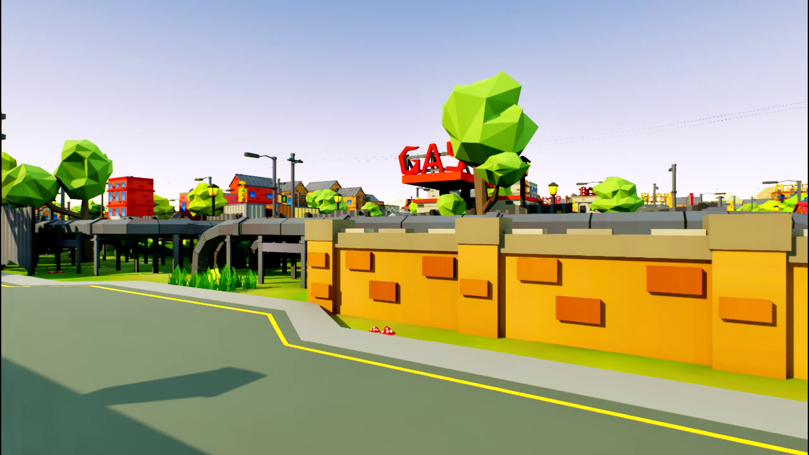
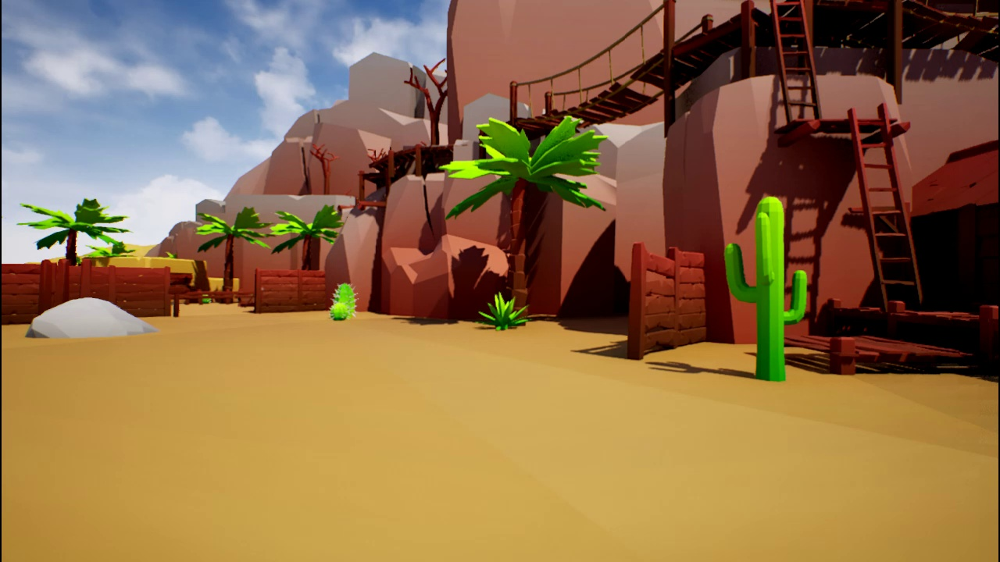
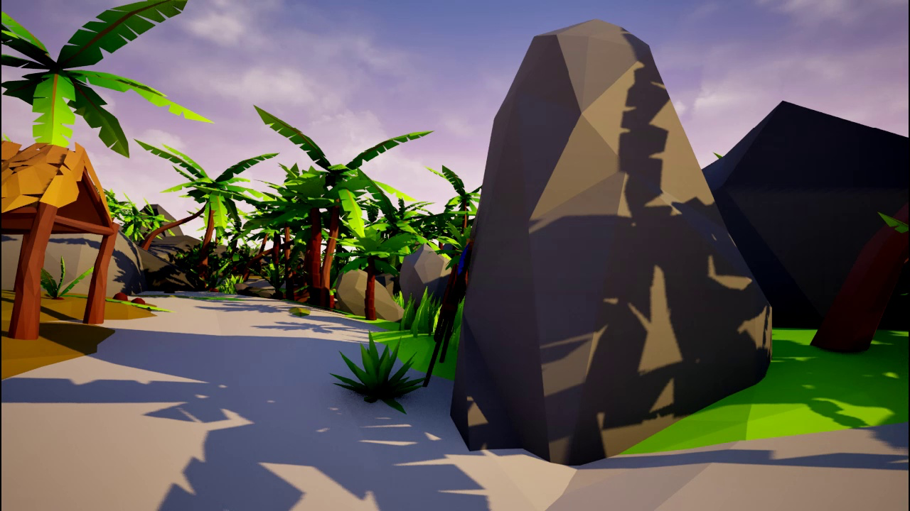
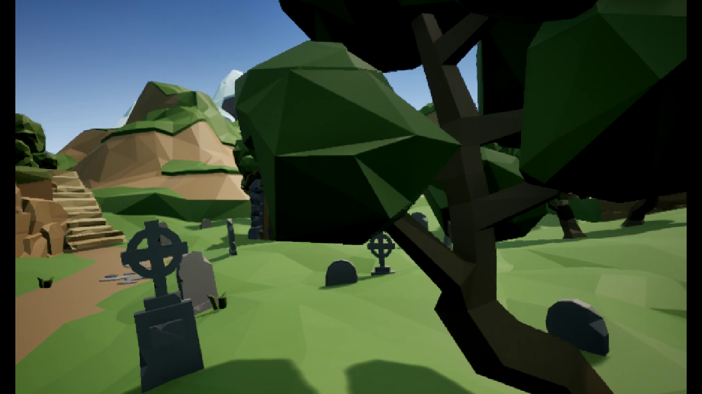
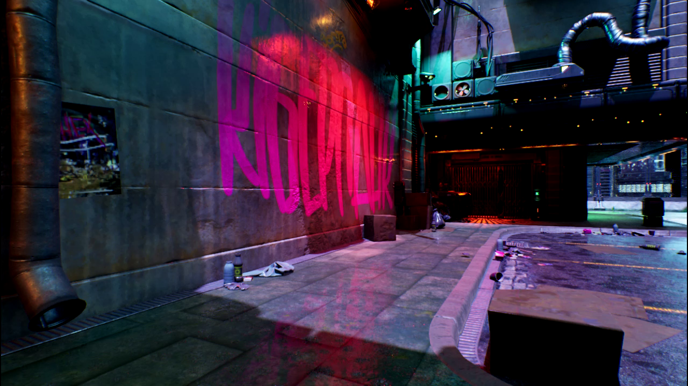

## {#title-slide data-background-color="oklch(0.12 0.015 265)" data-background-image="assets/matrix-game/mg3/demo-001.png" data-background-opacity="0.3"}

::: {.fragment .slide-up}
### Matrix-Game 3.0

**Real-Time World Simulation with Long-Horizon Memory**

[720p]{.hi-gold} · [40 fps]{.hi-gold} · [28B MoE]{.hi-gold} · [Minute-Long Coherent Generation]{.hi-gold}
:::

::: {.fragment .fade-in-smooth}
<video src="assets/matrix-game/mg3/demo-video.mp4" autoplay loop muted playsinline style="width:100%;border-radius:12px"></video>
:::

::: {.notes}
Welcome to Matrix-Game 3.0 — the most capable open-source interactive world model to date. We're generating 720p video at 40 frames per second with minute-long temporal coherence. This is the full vision of real-time world simulation. Let the demo video speak for itself first, then we'll dive into how we got here.
:::

---

## "What does it take to simulate a world?" {data-background-color="oklch(0.12 0.015 265)"}

::: {.fragment .slide-up style="--i: 0"}
A world model must **see** — perceive the environment at high fidelity
:::

::: {.fragment .slide-up style="--i: 1"}
A world model must **remember** — maintain consistency over long horizons
:::

::: {.fragment .slide-up style="--i: 2"}
A world model must **react** — respond to player input in real time
:::

::: {.keybox .fragment .slide-up style="--i: 3"}
**Matrix-Game 3.0** does all three — simultaneously, at 40 fps, for over a minute.
:::

::: {.notes}
This is the fundamental question behind the Matrix-Game project. Simulating a world isn't just about generating pretty frames — it requires perception, memory, and reactivity working together in real time. Previous models could do one or two of these, but not all three. Matrix-Game 3.0 is our answer: a system that sees at 720p, remembers across thousands of frames, and reacts to player input at 40 fps. Let me show you how we got here.
:::

---

## The Journey: v1 → v2 → v3 {data-background-color="oklch(0.14 0.015 265)"}

```{mermaid}
%%| fig-width: 18
%%| fig-responsive: true
timeline
    title Matrix-Game Evolution
    May 2025 : v1.0 — Foundation
               : 17B parameters
               : Minecraft-only
               : Offline generation
               : First open-source world model
    Aug 2025 : v2.0 — Real-Time
               : 5B parameters (optimized)
               : Multi-game (GTA, TempleRun)
               : 25 fps streaming
               : Single GPU inference
    Mar 2026 : v3.0 — Full Vision
               : 28B MoE (2×14B)
               : 10+ environments
               : 40 fps at 720p
               : Long-horizon memory
```

::: {.notes}
Here's the evolution. Version 1 proved that open-source world models could work — 17 billion parameters generating Minecraft worlds, but offline only. Version 2 made it real-time — 25 fps streaming across multiple games on a single GPU. Now, version 3 is the full vision: 28 billion parameters with mixture-of-experts, 40 fps at 720p resolution, and — critically — long-horizon memory that keeps scenes coherent for over a minute. Let's dig into the three breakthroughs that made this possible.
:::

---

## Breakthrough 1 — Memory {.section-header data-background-color="oklch(0.14 0.015 265)"}

::: {.notes}
The first and most important breakthrough in v3 is the memory system. Without it, long sequences drift — objects disappear, scenes change randomly, and the illusion of a coherent world breaks down. Let's look at the problem and our solution.
:::

---

## The Memory Problem

:::: {.two-col}
::: {.warningbox}
**Without Memory**

- Objects vanish after 50 frames
- Scene style drifts over time
- Camera returns show different environments
- Player actions have no lasting effect
- Generation limited to ~3 seconds
:::

::: {.tipbox}
**With Long-Horizon Memory**

- Objects persist across thousands of frames
- Consistent style and lighting throughout
- Camera-aware spatial consistency
- Actions create lasting world changes
- Coherent generation for **60+ seconds**
:::
::::

::: {.keybox}
**The core insight:** A world model without memory is just a video generator. Memory is what makes it a *world*.
:::

::: {.notes}
This is the fundamental problem. Previous approaches — including our own v1 and v2 — generated frames by conditioning on only the most recent outputs. After about 50 frames, things start to drift. Objects vanish. The style changes. If you turn the camera around and come back, it's a completely different scene. Our long-horizon memory system fixes all of these issues, enabling coherent generation for over 60 seconds. Let me show you how the architecture works.
:::

---

## Memory Architecture {data-background-color="oklch(0.14 0.015 265)"}

```{mermaid}
%%| fig-width: 18
%%| fig-responsive: true
flowchart LR
    subgraph INPUT["Input Pipeline"]
        A[Current Frame] --> B[Diffusion Transformer]
        C[Player Actions] --> B
    end

    subgraph MEMORY["Long-Horizon Memory"]
        D[Frame Re-injection<br/>Past keyframes fed back] --> B
        E[Camera-Aware Memory<br/>Pose-indexed spatial cache] --> B
    end

    subgraph CORRECTION["Self-Correction"]
        B --> F[Predicted Frame]
        F --> G[Prediction Residuals<br/>Error = Predicted - Actual]
        G --> H[Correction Signal]
        H --> B
    end

    F --> I[Output Frame<br/>720p @ 40fps]

    style INPUT fill:#3730a3,color:#fff,stroke:#7c79c4
    style MEMORY fill:#1a8a8a,color:#fff,stroke:#8fc4c4
    style CORRECTION fill:#c69a2d,color:#fff,stroke:#e8d49a
```

::: {.methodbox}
**Four-part memory system:** Frame re-injection maintains visual anchors. Camera-aware memory indexes scenes by spatial position. Prediction residuals detect drift. Self-correction feeds errors back to prevent accumulation.
:::

::: {.notes}
The memory architecture has four interlocking components. First, frame re-injection — we periodically feed past keyframes back into the diffusion process as anchors. Second, camera-aware memory — we maintain a spatial cache indexed by camera pose, so when you revisit an area, the model remembers what was there. Third, prediction residuals — we compute the difference between what the model predicted and what actually happened, which gives us a drift signal. Fourth, self-correction — that drift signal is fed back into the next prediction step, preventing error accumulation. Together, these four components keep generation coherent for over a minute.
:::

---

## Breakthrough 2 — Speed {.section-header data-background-color="oklch(0.14 0.015 265)"}

::: {.notes}
Memory gives us coherence, but coherence is useless if it's not real-time. Breakthrough two is about raw speed — going from 25 fps at low resolution to 40 fps at 720p. That's a massive jump in both framerate and pixel count.
:::

---

## 40 FPS at 720p {data-background-color="oklch(0.12 0.015 265)"}

:::: {.two-col}
::: {.column}

::: {style="font-size: 3.5em; font-weight: 800; line-height: 1.1; color: oklch(0.72 0.16 85); font-family: 'Plus Jakarta Sans', sans-serif;"}
40 fps
:::

::: {style="font-size: 2em; font-weight: 600; color: oklch(0.75 0.08 195); font-family: 'Plus Jakarta Sans', sans-serif; margin-top: 0.2em;"}
720p resolution
:::

::: {style="font-size: 1.2em; color: oklch(0.65 0.008 265); margin-top: 0.8em;"}
60% faster framerate · 4x the pixels · Real-time interactive
:::

:::

::: {.column}

| Metric | v1 | v2 | **v3** |
|:---|:---:|:---:|:---:|
| Resolution | 256p | 360p | [**720p**]{.hi-gold} |
| Framerate | Offline | 25 fps | [**40 fps**]{.hi-gold} |
| Coherence | ~2s | ~5s | [**60s+**]{.hi-gold} |
| Parameters | 17B | 5B | [**28B MoE**]{.hi-gold} |
| GPU | 4×A100 | 1×A100 | [**1×A100**]{.hi-gold} |

:::
::::

::: {.notes}
Here's the headline number: 40 frames per second at 720p resolution on a single A100 GPU. Compare this to v2, which did 25 fps at 360p, and v1, which was offline-only at 256p. We're generating 4 times the pixels at 60 percent higher framerate — while maintaining coherence for over a minute. And we achieved this while scaling the model from 5B to 28B parameters. The secret is our distillation and optimization pipeline.
:::

---

## DMD Distillation: 50 Steps → 3 Steps

```{mermaid}
%%| fig-width: 18
%%| fig-responsive: true
flowchart LR
    subgraph TEACHER["Teacher Model — 50 Steps"]
        T1[Step 1] --> T2[Step 2] --> T3["..."] --> T4[Step 50]
        T4 --> TQ["High Quality<br/>~1.2 fps"]
    end

    subgraph DISTILL["Distribution Matching<br/>Distillation"]
        TQ --> D1[Match output<br/>distributions]
        D1 --> D2[Train student to<br/>replicate quality]
    end

    subgraph STUDENT["Student Model — 3 Steps"]
        S1[Step 1] --> S2[Step 2] --> S3[Step 3]
        S3 --> SQ["Same Quality<br/>~40 fps"]
    end

    D2 --> S1

    style TEACHER fill:#3730a3,color:#fff,stroke:#7c79c4
    style DISTILL fill:#c69a2d,color:#fff,stroke:#e8d49a
    style STUDENT fill:#2d9050,color:#fff,stroke:#50c878
```

::: {.keybox}
**17x compression** in denoising steps with minimal quality loss. Distribution Matching Distillation (DMD) trains a student model to produce the same output distribution as the teacher in just 3 steps.
:::

::: {.notes}
The key speed innovation is DMD — Distribution Matching Distillation. Standard diffusion models need 50 denoising steps per frame, giving us about 1.2 fps. That's obviously not real-time. DMD trains a student model to match the output distribution of the teacher in just 3 steps — a 17x reduction. The beauty is that we're matching distributions, not individual samples, so the student learns the full range of possible outputs. Combined with LightVAE and INT8 quantization, this gets us to 40 fps.
:::

---

## LightVAE + Quantization

:::: {.two-col}
::: {.column}
### Inference Optimization Stack

::: {.methodbox}
**LightVAE Decoder Distillation**

Original VAE decoder is the bottleneck at high resolution. We distill a lightweight decoder variant with configurable pruning ratios.
:::

::: {.methodbox}
**INT8 Quantization**

Post-training quantization of the diffusion backbone reduces memory and increases throughput with negligible quality impact.
:::
:::

::: {.column}
### Speed vs Quality Tradeoffs

| Config | Pruning | FPS | Quality |
|:---|:---:|:---:|:---:|
| Full | 0% | 28 | [Baseline]{.subtle} |
| Light-50 | 50% | 35 | -0.8% |
| Light-75 | 75% | [**40**]{.hi-gold} | -1.5% |
| Light-75 + INT8 | 75% | [**42**]{.hi-gold} | -2.1% |

::: {.tipbox}
**Sweet spot:** Light-75 achieves 40 fps with just 1.5% quality loss — imperceptible in interactive use.
:::
:::
::::

::: {.notes}
Two more optimizations complete the speed story. First, LightVAE — the VAE decoder becomes a bottleneck at 720p resolution. We distill a lightweight variant with 75% pruning, which gives us a 43% speed boost with only 1.5% quality loss. Second, INT8 post-training quantization of the diffusion backbone — this squeezes out another 2 fps. The sweet spot is Light-75 at 40 fps, where the quality loss is imperceptible during interactive use. The INT8 variant at 42 fps is also available for maximum throughput.
:::

---

## Breakthrough 3 — Scale {.section-header data-background-color="oklch(0.14 0.015 265)"}

::: {.notes}
The third breakthrough is about scaling the model and the data. We went from 5 billion dense parameters to 28 billion with mixture-of-experts, and we built a new data engine that combines synthetic, game, and real-world video.
:::

---

## 28B MoE: Scaling with Experts {data-background-color="oklch(0.14 0.015 265)"}

```{mermaid}
%%| fig-width: 16
%%| fig-responsive: true
flowchart TB
    INPUT[Input Tokens<br/>Frame + Action + Memory] --> ROUTER[Expert Router<br/>Top-2 Gating]
    ROUTER --> E1[Expert 1<br/>14B — Outdoor Scenes]
    ROUTER --> E2[Expert 2<br/>14B — Indoor Scenes]
    ROUTER --> E3[Expert 3<br/>14B — Dynamic Objects]
    ROUTER --> E4[Expert 4<br/>14B — Lighting & Weather]
    E1 --> MERGE[Weighted Merge]
    E2 --> MERGE
    E3 --> MERGE
    E4 --> MERGE
    MERGE --> OUTPUT[Output Tokens]

    style ROUTER fill:#c69a2d,color:#fff,stroke:#e8d49a
    style E1 fill:#3730a3,color:#fff,stroke:#7c79c4
    style E2 fill:#1a8a8a,color:#fff,stroke:#8fc4c4
    style E3 fill:#2d9050,color:#fff,stroke:#50c878
    style E4 fill:#b83a3a,color:#fff,stroke:#e07070
```

::: {.keybox}
**2x14B Mixture-of-Experts** — 28B total parameters, but only 14B active per token. Same inference cost as a 14B dense model with superior quality and generalization.
:::

::: {.notes}
The scaling story is mixture-of-experts. We have four expert subnetworks of 14 billion parameters each, giving 28B total. A top-2 gating mechanism routes each token to the two most relevant experts. The key insight: only 14 billion parameters are active per token, so inference cost is equivalent to a 14B dense model — but the model has twice the capacity for learning different scene types. Different experts naturally specialize in different aspects: outdoor environments, indoor spaces, dynamic objects, and lighting conditions. This is what enables the incredible diversity you'll see in the demo gallery.
:::

---

## Upgraded Data Engine

:::: {.three-col}
::: {.column}
::: {.methodbox}
**Unreal Engine Synthetic**

Procedurally generated environments with perfect camera, depth, and action labels. Unlimited scale.
:::
:::

::: {.column}
::: {.methodbox}
**AAA Game Capture**

Real gameplay from diverse titles. Rich dynamics, realistic physics, varied visual styles.
:::
:::

::: {.column}
::: {.methodbox}
**Real-World Video**

Driving footage, nature scenes, urban environments. Bridges the sim-to-real gap.
:::
:::
::::

::: {.infobox}
**Three-stream data pipeline** — 2M+ hours of diverse training data converging into a unified format with standardized action annotations. Synthetic data provides clean labels, game data provides visual diversity, real-world data provides physical grounding.
:::

::: {.notes}
The data engine is completely rebuilt for v3. We combine three data streams. First, Unreal Engine synthetic data — procedurally generated with perfect labels. Second, AAA game capture from diverse titles — this gives us the visual richness and dynamic variety that synthetic data alone can't match. Third, real-world video — driving footage, nature scenes, and urban environments that bridge the sim-to-real gap. Over 2 million hours of training data, all standardized with our unified action annotation format. This is what enables the model to generate scenes across such a wide range of environments.
:::

---

## Visual Showcase {.section-header data-background-color="oklch(0.14 0.015 265)"}

::: {.notes}
Enough architecture. Let's see what Matrix-Game 3.0 can actually generate. These are all real-time outputs — player-controlled, 720p, 40 fps.
:::

---

## Worlds Matrix-Game Can Dream {data-background-color="oklch(0.10 0.015 265)"}

:::: {style="display: grid; grid-template-columns: repeat(5, 1fr); gap: 12px; padding: 0;"}
::: {}
{fig-alt="AI-generated futuristic cityscape at dusk with neon lighting and towering skyscrapers" width="100%"}
:::
::: {}
{fig-alt="AI-generated arid desert town with sandstone buildings and warm sunlight" width="100%"}
:::
::: {}
{fig-alt="AI-generated lush green forest trail with dappled sunlight through the canopy" width="100%"}
:::
::: {}
{fig-alt="AI-generated sci-fi corridor with metallic walls and atmospheric blue lighting" width="100%"}
:::
::: {}
{fig-alt="AI-generated neon-lit urban alley with colorful graffiti on brick walls" width="100%"}
:::
::::

::: {.keybox}
**5 diverse environments** — all generated in real time at 720p, 40 fps, with player keyboard and mouse control. From futuristic cities to forest trails, from sci-fi corridors to urban streets.
:::

::: {.notes}
This is the slide people photograph. Five completely different environments, all generated in real time by the same model. A futuristic cityscape, an arid desert town, a lush forest trail, a sci-fi corridor, and a neon graffiti alley. Each of these maintains coherence for over 60 seconds of continuous player interaction. The mixture-of-experts architecture is what makes this diversity possible — different experts activate for different scene types.
:::

---

## Interactive Control {data-background-color="oklch(0.14 0.015 265)"}

:::: {.two-col}
::: {.column}
{fig-alt="Diagram showing keyboard WASD movement and mouse look controls mapped to world model action conditioning" width="100%"}
:::

::: {.column}
### Player-Driven World Generation

- **WASD** — Movement through the environment
- **Mouse** — Camera look direction (yaw + pitch)
- **Actions** injected at each denoising step
- **Camera pose** feeds into spatial memory

::: {.tipbox}
**Real interactivity:** The model doesn't just play back video — it generates new frames conditioned on your exact inputs, every 25ms.
:::
:::
::::

::: {.notes}
This isn't pre-rendered video. The player controls the camera and movement with standard WASD plus mouse input, and the model generates new frames at every step conditioned on those exact inputs. The action conditioning module injects keyboard and mouse signals at each denoising step, and the camera pose feeds directly into the spatial memory system. This creates a genuine interactive experience — the world responds to you in real time, and it remembers where you've been.
:::

---

## The Evolution: v1 → v2 → v3 {data-background-color="oklch(0.12 0.015 265)"}

:::: {.three-col}
::: {.column}

::: {style="text-align: center;"}
### v1.0 — Foundation

**May 2025**
:::

- 17B dense parameters
- Minecraft-only
- Offline generation
- First open-source world model

::: {.infobox}
**Proved** that open-source interactive world models are possible.
:::
:::

::: {.column}

::: {style="text-align: center;"}
### v2.0 — Real-Time

**Aug 2025**
:::

- 5B optimized
- GTA, TempleRun, universal scenes
- 25 fps streaming
- Single GPU (A100)

::: {.infobox}
**Achieved** real-time generation across multiple domains.
:::
:::

::: {.column}

::: {style="text-align: center;"}
### [v3.0 — Full Vision]{.hi-gold}

**Mar 2026**
:::

- [28B MoE (2x14B)]{.hi-gold}
- [10+ diverse environments]{.hi-gold}
- [40 fps at 720p]{.hi-gold}
- [60s+ coherent generation]{.hi-gold}

::: {.keybox}
**Delivered** the complete world simulation system.
:::
:::
::::

::: {.notes}
This is the complete Matrix-Game story. Version 1 was the proof of concept — could we build an open-source world model at all? Yes, with 17 billion parameters for Minecraft. Version 2 made it practical — real-time at 25 fps, working across multiple game engines. Version 3 is the full vision — 28 billion parameters with mixture-of-experts, 40 fps at 720p, long-horizon memory for minute-long coherence, and generation across diverse environments from sci-fi corridors to forest trails. Each version built on the last, and each version was open-sourced.
:::

---

## Open Source: Apache 2.0 {data-background-color="oklch(0.12 0.015 265)"}

::: {.keybox}
**Everything is open.** Model weights, training code, data pipeline, and evaluation benchmarks — all released under Apache 2.0.
:::

:::: {.two-col}
::: {.column}
### What We Release

- 28B MoE model weights (HuggingFace)
- Full training and inference code
- Data pipeline and annotation tools
- LightVAE distilled decoder variants
- DMD student model checkpoints
- Evaluation benchmark suite
:::

::: {.column}
### Build With Us

- **HuggingFace:** skywork-ai/matrix-game-3
- **GitHub:** github.com/skywork-ai/matrix-game
- **License:** Apache 2.0

::: {.quotebox}
"The future of world simulation should be built in the open."

[— Skywork AI Matrix-Game Team]{.attribution}
:::
:::
::::

::: {.notes}
Everything we've shown today is open source under Apache 2.0. The full 28B model weights are on HuggingFace. The training code, inference pipeline, data tools, distilled models, and evaluation benchmarks are all on GitHub. We believe the future of world simulation should be built in the open — this is too important to be locked behind closed APIs. Thank you. We're excited to see what the community builds with Matrix-Game 3.0.
:::
