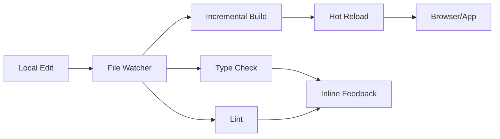

## The Story {.section-header}

::: {.notes}
Open with a narrative hook, not a feature list.
What problem were you personally frustrated by?
:::

---

## It Started With a Problem

:::: {.two-col}
::: {.div}
### The Frustration

Every time we deployed, the same ritual:

1. Push code
2. Wait 12 minutes for CI
3. Discover a config mismatch
4. Fix it, push again
5. Wait another 12 minutes
6. [Repeat until despair]{.hi-red}

We were spending [**40% of engineering time**]{.hi} waiting for feedback loops to close.
:::

::: {.quotebox}
"The best developer experience is one where the tool disappears entirely and you just... build."

[— Someone on our team, probably at 2am]{.attribution}
:::
::::

::: {.notes}
Make it personal and relatable. Every developer has lived this experience.
The specific numbers (12 minutes, 40%) make it concrete.
:::

---

## What We Built

::: {.keybox}
**The Core Idea**

A local development environment that mirrors production [**exactly**]{.hi} — with feedback in under 3 seconds instead of 12 minutes.
:::

Three principles guided the design:

- [**Fidelity**]{.hi} — Local must equal production, no "works on my machine"
- [**Speed**]{.hi-gold} — Sub-3-second feedback on every change
- [**Simplicity**]{.hi-green} — One command to start, zero config to maintain

---

## Architecture {.section-header}

---

## How It Works



The key insight: [**parallelize everything, serialize nothing**]{.hi}.

::: {.notes}
Walk through the data flow. Emphasize that the file watcher triggers
ALL downstream processes simultaneously, not sequentially.
:::

---

## The Engine: Incremental Compilation

```typescript
// The old way: rebuild everything on every change
async function buildAll(files: string[]): Promise<BuildResult> {
  const ast = await parseAll(files);        // 2.1s
  const checked = await typeCheck(ast);      // 4.3s
  const output = await generate(checked);    // 1.8s
  return output;                             // Total: 8.2s
}

// The new way: only rebuild what changed
async function buildIncremental(
  changed: FileChange[],
  cache: DependencyGraph
): Promise<BuildResult> {
  const affected = cache.getAffected(changed);  // 12ms
  const ast = await parseOnly(affected);         // 180ms
  const checked = await typeCheckScope(ast);     // 340ms
  const output = await generateDelta(checked);   // 90ms
  return output;                                 // Total: 622ms
}
```

::: {.tipbox}
**Key Optimization**

The dependency graph tracks which files are affected by a change. Instead of rebuilding 2,000 files, we typically rebuild 3-15.
:::

---

## Dependency Graph in Action

:::: {.comparison}
::: {.compare-left}
### Before: Full Rebuild

- Parse all 2,000 files
- Type-check entire project
- Generate all outputs
- **8.2 seconds** per change
- Developer context destroyed
:::

::: {.compare-right}
### After: Incremental

- Parse only affected files (avg: 8)
- Type-check changed scope only
- Generate delta output
- **622ms** per change
- Flow state preserved
:::
::::

---

## The Hard Parts {.section-header}

::: {.notes}
This is where the talk gets valuable. Anyone can describe what they built.
The lessons from what went wrong are what people actually learn from.
:::

---

## Lesson 1: Cache Invalidation

::: {.warningbox}
**The Classic Problem**

Cache invalidation in a dependency graph with circular references, dynamic imports, and re-exports. Our first implementation had a bug that caused stale state in 1 out of every ~200 builds.

Users noticed.
:::

The fix required a complete rethink of the invalidation strategy:

```typescript
// Naive: invalidate direct dependents only
function invalidateNaive(file: string, graph: Graph): Set<string> {
  return graph.directDependentsOf(file);  // Misses transitive deps
}

// Correct: walk the full dependent tree with cycle detection
function invalidateCorrect(file: string, graph: Graph): Set<string> {
  const affected = new Set<string>();
  const queue = [file];
  while (queue.length > 0) {
    const current = queue.pop()!;
    if (affected.has(current)) continue;  // Cycle guard
    affected.add(current);
    queue.push(...graph.directDependentsOf(current));
  }
  return affected;
}
```

---

## Lesson 2: Don't Fight the Platform

:::: {.two-col}
::: {.div}
### What We Tried

We built a custom file watcher from scratch using `inotify` / `FSEvents` directly.

- Handled symlinks ourselves
- Built our own event deduplication
- Wrote platform-specific code for Linux, macOS, Windows

**Result:** 6 months of platform bugs. Subtle race conditions that only reproduced on CI.
:::

::: {.div}
### What We Should Have Done

::: {.tipbox}
**Use What Exists**

Switched to `chokidar` (later `@parcel/watcher`) and got:

- Battle-tested platform handling
- Community-maintained edge cases
- 90% less platform-specific code
:::

::: {.keybox}
**Lesson**

Don't rebuild solved problems. Your unique value is in the [**integration**]{.hi}, not the primitives.
:::
:::
::::

---

## Lesson 3: Measure What Matters

```python
# We tracked the wrong metric at first
metrics = {
    "build_time_p50": 0.45,   # Looks great!
    "build_time_p99": 12.30,  # This is the real number
}

# After switching to percentile-aware metrics:
# - p50 was fine, p99 was TERRIBLE
# - 1% of builds taking 12+ seconds = multiple bad experiences per hour
# - Root cause: garbage collection pauses in the type checker
```

::: {.warningbox}
**Anti-Pattern**

Median metrics hide pain. If your tool works great 99% of the time but catastrophically fails 1% of the time, users will remember the failures.

Always measure and optimize for [**p99**]{.hi-red}, not p50.
:::

---

## Results {.section-header}

---

## Impact After 6 Months

:::: {.three-col}
::: {.div}
### Speed

- Build time: **8.2s → 0.6s**
- CI time: **12min → 3min**
- Deploy confidence: **High**
:::

::: {.div}
### Adoption

- **100K+** active developers
- **4.8/5** satisfaction score
- **92%** daily active retention
:::

::: {.div}
### Engineering Impact

- **40% less** time waiting
- **2.3x** deploy frequency
- **67% fewer** config-related incidents
:::
::::

---

## What's Next

:::: {.sidebar-right}
::: {.div}
### Roadmap

1. **AI-assisted error resolution** — Suggest fixes based on error patterns
2. **Collaborative mode** — Share running dev environments with teammates
3. **Plugin ecosystem** — Open the build pipeline to community extensions
4. **Edge deployment preview** — Test against edge infrastructure locally
:::

::: {.methodbox}
**Open Source**

We're open-sourcing the incremental build engine in Q3.

The platform-specific code stays proprietary, but the core algorithms — dependency graph, cache invalidation, delta generation — will be available to everyone.
:::
::::

---

## Key Takeaways

::: {.keybox}
**Three Things to Remember**

1. [**Measure p99, not p50**]{.hi} — Your worst experience defines your product
2. [**Don't rebuild primitives**]{.hi-gold} — Your value is in the integration layer
3. [**Speed is a feature**]{.hi-green} — Sub-second feedback changes how people work
:::

::: {.quotebox}
"The tool disappeared, and we just... built."

[— Actual user feedback, 6 months post-launch]{.attribution}
:::

[Thank you — Let's talk!]{.larger}

::: {.notes}
Callback to the opening quote. Narrative closure matters.
Leave time for Q&A — the best part of tech talks is the conversation.
:::
